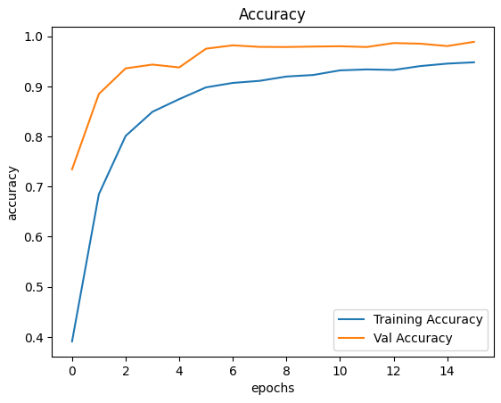
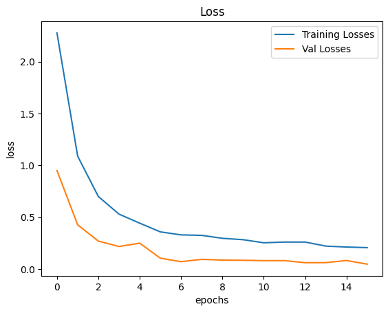
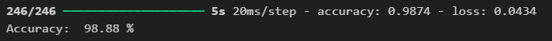

# Traffic Sign Recognition using Convolutional Neural Networks (CNNs)

This project focuses on traffic sign recognition using Convolutional Neural Networks (CNNs). The model achieves an impressive accuracy of 98.88% in classifying various traffic signs, making it a valuable tool for enhancing road safety.

## Project Overview

The objective of this project is to develop a robust deep learning model capable of accurately classifying traffic signs. This can be beneficial for autonomous driving systems and improving overall traffic safety.

## Model Performance

- **Accuracy:** 98.88%

### 1. Training and Validation Accuracy


*Figure 1: Training and validation accuracy during model training.*

### 2. Training and Validation Loss


*Figure 2: Training and validation loss during model training.*
### 3. Final Model Accuracy



*Figure 3: Final accuracy achieved by the trained model.*
## Technologies Used

- **Programming Language:** Python
- **Deep Learning Framework:** TensorFlow/Keras
- **Image Processing:** PIL (Python Imaging Library)
- **GUI:** CustomTkinter
- **Data Handling:** NumPy, Pandas
- **Model Evaluation:** Scikit-learn

## Model Architecture

The CNN model consists of the following layers:

1. **Convolutional Layer** (64 filters, 5x5 kernel, ReLU activation)
2. **Convolutional Layer** (64 filters, 5x5 kernel, ReLU activation)
3. **Max Pooling Layer** (2x2 pool size)
4. **Dropout Layer** (0.3 dropout rate)
5. **Convolutional Layer** (32 filters, 5x5 kernel, ReLU activation)
6. **Convolutional Layer** (32 filters, 5x5 kernel, ReLU activation)
7. **Max Pooling Layer** (2x2 pool size)
8. **Dropout Layer** (0.3 dropout rate)
9. **Flatten Layer**
10. **Dense Layer** (128 units, ReLU activation)
11. **Output Layer** (softmax activation)
## Project Structure

- `Main-project.ipynb`: Jupyter notebook containing all code cells for data preprocessing, model training, evaluation, and visualization.
- `TSR_APP.py`: Complete Python script consolidating all the code for easy execution.

## Installation and Usage

### Prerequisites

Ensure you have the following libraries installed:

```bash
pip install tensorflow keras pillow matplotlib numpy pandas scikit-learn customtkinter
```
## Steps to Run the project

### 1. Clone the repository

```bash
git clone https://github.com/your-username/traffic-sign-recognition.git
cd traffic-sign-recognition
```
### 2. Download the dataset

Dataset are in the **DATA** folder 

### 3. Run the Jupyter notebook:

```bash
jupyter notebook Main-project.ipynb
```
or you can run each cell in the jupyter notebook to understand the code of each part of the project : *data preprocessing, model training, evaluation, and visualization*

### 4. Execute the complete script

```bash
python TSR_APP.py
```
## Dataset

The dataset used for this project is the GTSRB - German Traffic Sign Recognition Benchmark, available on Kaggle, you can download it from this link : <https://www.kaggle.com/datasets/meowmeowmeowmeowmeow/gtsrb-german-traffic-sign> 
The images are preprocessed and resized to **30x30 pixels** before being fed into the CNN model.

## Results

The model achieves an **accuracy of 98.88%** on the test dataset, demonstrating its effectiveness in recognizing traffic signs.

## Future Work

Future improvements and applications could include:

- **Expansion to Automotive Use:** Implementing the traffic sign recognition model in automotive systems for real-time sign detection and interpretation.

- **Deployment in Real-World Scenarios:** Testing and deploying the model in real-world automotive applications to validate its performance and reliability in varying conditions.

## Contact

For any questions or feedback regarding this project, feel free to contact me:

- **Email:**  walid.elhannach@usmba.ac.ma
- **Linkedln:** <https://www.linkedin.com/in/walid-el-hannach-a81984189?utm_source=share&utm_campaign=share_via&utm_content=profile&utm_medium=ios_app>
